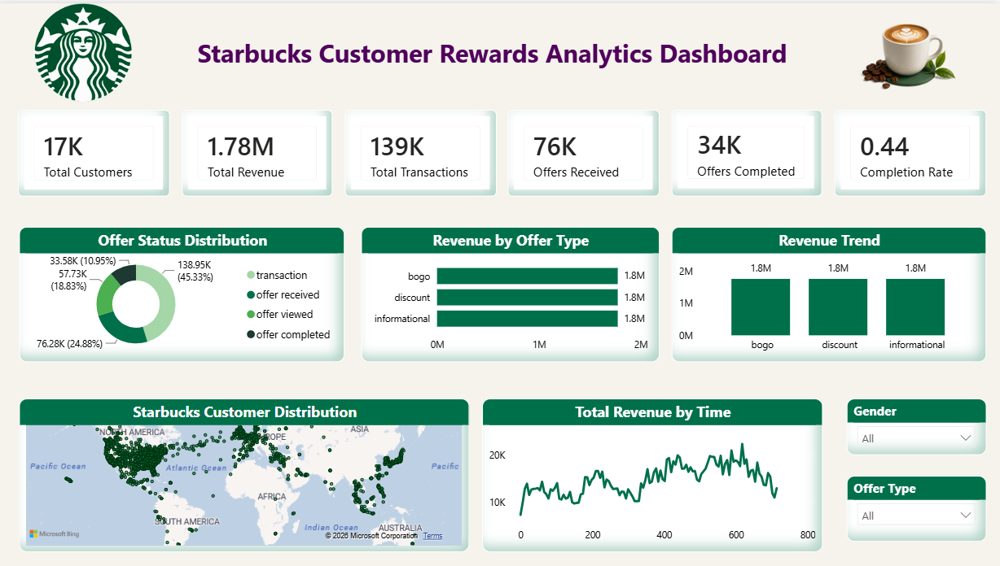

# Starbucks-Customer-Rewards-Analytics
# ☕ Starbucks Customer Rewards Analytics Dashboard

<p align="center">
  
</p>

---

## 📌 Project Overview

This project is an end-to-end **Business Intelligence Dashboard** built using **Power BI**, analyzing Starbucks customer behavior, offer performance, and revenue trends. The dashboard provides actionable insights into how customers respond to reward offers — helping stakeholders make data-driven marketing and operational decisions.

---

## 👤 Author

**Thippavathi Hemanth Kumar**
🔗 GitHub: [github.com/hemanthmikkie/Mikkie](https://github.com/hemanthmikkie/Mikkie)

---

## 📊 Dashboard KPIs at a Glance

| Metric | Value |
|---|---|
| Total Customers | 17K |
| Total Revenue | 1.78M |
| Total Transactions | 139K |
| Offers Received | 76K |
| Offers Completed | 34K |
| Completion Rate | 0.44 (44%) |

---

## 🗂️ Datasets Used

| File | Description | Records |
|---|---|---|
| `starbucks.csv` | Menu items with full nutrition info (calories, fat, sugar, caffeine) | 242 rows |
| `directory.csv` | Global Starbucks store locations with coordinates | 25,601 stores |
| `profile.csv` | Customer demographics — age, gender, income, membership date | 17,000 customers |
| `portfolio.csv` | Offer details — type, reward, difficulty, duration, channels | 10 offers |
| `transcript.csv` | Customer events — offer received, viewed, completed, transactions | 306,534 events |

---

## 🛠️ Tools & Technologies

| Tool | Purpose |
|---|---|
| **Power BI Desktop** | Dashboard design, DAX measures, data modeling |
| **Power Query (M)** | Data cleaning and transformation |
| **DAX** | KPI calculations, measures, conditional logic |
| **Microsoft Bing Maps** | Store location map visual |
| **Excel / CSV** | Raw data source files |

---

## 🧹 Data Cleaning (Power Query)

The following cleaning steps were applied to each dataset:

**starbucks.csv (Menu Nutrition)**
- Removed leading spaces from column names (e.g., `" Total Fat (g)"` → `"Total Fat (g)"`)
- Changed numeric columns (Calories, Sugar, Caffeine etc.) to Decimal Number type
- Removed duplicate beverage rows
- Trimmed whitespace from text columns

**directory.csv (Store Locations)**
- Filtered Brand column to keep only `Starbucks` (removed Teavana)
- Removed unnecessary columns (street address, phone, postcode)
- Changed Latitude and Longitude to Decimal Number type
- Replaced blank City values with `"Unknown"`

**profile.csv (Customers)**
- Removed fake age value `118` (placeholder for unknown age)
- Changed `became_member_on` to Date type
- Added a custom `Age_Group` column (18–29, 30–44, 45–59, 60+)
- Replaced null income values with `0`

**portfolio.csv (Offers)**
- Renamed `id` → `offer_id`
- Expanded `channels` list column into separate rows
- Changed reward, difficulty, duration to Whole Number type

**transcript.csv (Events)**
- Renamed `person` → `customer_id`
- Expanded the `value` Record column to extract `offer_id` and `amount`
- Replaced null `Transaction_Amount` with `0`

---

## 🗃️ Data Model

A **Star Schema** was used for the customer offer analysis:

```
Customers (profile)        Offers (portfolio)
      |                          |
      └──────── Events (transcript) ────────┘
                   (Fact Table)
```

**Relationships:**
- `Events[customer_id]` → `Customers[customer_id]` — Many to One
- `Events[offer_id]` → `Offers[offer_id]` — Many to One

---

## 📐 DAX Measures

```dax
-- Total Revenue
Total Revenue = 
CALCULATE(SUM(Events[Transaction_Amount]), Events[event] = "transaction")

-- Offer Completion Rate
Completion Rate = 
DIVIDE(
    CALCULATE(COUNTROWS(Events), Events[event] = "offer completed"),
    CALCULATE(COUNTROWS(Events), Events[event] = "offer received")
)

-- Total Customers
Total Customers = DISTINCTCOUNT(Events[customer_id])

-- Total Transactions
Total Transactions = 
CALCULATE(COUNTROWS(Events), Events[event] = "transaction")

-- Offers Received
Offers Received = 
CALCULATE(COUNTROWS(Events), Events[event] = "offer received")

-- Offers Completed
Offers Completed = 
CALCULATE(COUNTROWS(Events), Events[event] = "offer completed")
```

---

## 📈 Dashboard Visuals

| Visual | Description |
|---|---|
| **6 KPI Cards** | Total Customers, Revenue, Transactions, Offers Received, Completed, Completion Rate |
| **Donut Chart** | Offer Status Distribution — transaction vs received vs viewed vs completed |
| **Bar Chart** | Revenue by Offer Type — BOGO, Discount, Informational |
| **Bar Chart** | Revenue Trend by Offer Type comparison |
| **Map Visual** | Starbucks Customer Distribution — global geographic spread |
| **Line Chart** | Total Revenue by Time — shows revenue fluctuation across time periods |
| **Slicers** | Filter by Gender and Offer Type |

---

## 💡 Key Business Insights

- **44% offer completion rate** — nearly half of all received offers were completed, indicating strong campaign effectiveness
- **BOGO, Discount, and Informational offers** each generated approximately **1.8M in revenue** — relatively even performance across all offer types
- **Revenue by time** shows a consistent upward trend with peaks around the 400–600 time period
- **Global customer distribution** is concentrated heavily in **North America**, with presence in Europe and Asia
- Offer viewed events (76.28K — 24.88%) represent a strong mid-funnel engagement signal

---

## 📁 Project Structure

```
Starbucks-PowerBI-Dashboard/
│
├── 📊 Starbucks_Customer_Rewards_Analytics_Dashboard.pbix
├── 📷 dashboard.png
├── 📄 README.md
│
└── 📂 data/
    ├── starbucks.csv       ← Menu nutrition data
    ├── directory.csv       ← Store locations
    ├── profile.csv         ← Customer demographics
    ├── portfolio.csv       ← Offer details
    └── transcript.csv      ← Customer events & transactions
```

---

## 🚀 How to Run This Project

1. Clone this repository:
   ```bash
   git clone https://github.com/hemanthmikkie/Mikkie.git
   ```
2. Open **Power BI Desktop** (free download from [powerbi.microsoft.com](https://powerbi.microsoft.com))
3. Open the file `Starbucks_Customer_Rewards_Analytics_Dashboard.pbix`
4. If prompted, update the data source path to your local `/data/` folder
5. Click **Refresh** to reload all data
6. Explore the interactive dashboard!

---

## 📌 Skills Demonstrated

`Power BI` `Power Query` `DAX` `Data Modeling` `Star Schema` `Data Cleaning` `KPI Analysis` `Dashboard Design` `Business Intelligence` `Data Visualization`

---

<p align="center">Made with ☕ by <strong>Thippavathi Hemanth Kumar</strong></p>
